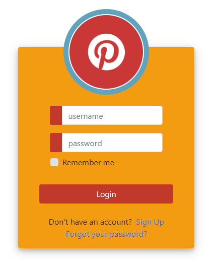

# Angular-Login

This project implements a simple web app with Home and Log-in views. 

<a href="https://josehervas.github.io/Angular-Login/">LIVE PREVIEW</a>



# Architecture

The project has 2 components (one for each view), 2 services (one for making the HTTP calls and other for managing user data), 2 routes and one auth guard.

- ## Component tree
```
AppComponent
    |
    |___ RouterOutlet
            |
            |___ HomeComponent
            |
            |___ LoginComponent
```

- ## Services

    - ApiService: makes HTTP calls
    - UserService: manages user's data. Uses an external api ("https://reqres.in/") to validate user data agains a mock back-end.

- ## Routes
    - /home and / both render the HomeComponent
    - /login render the LoginComponent

- ## Guards
    - AuthGuard: Using the UserService, checks if client has a valid token on the localStorage. If it dosn't, redirects to /login

# Dependencies

- Angular 7
- Bootstrap 4 (uses CDN)

# How to use
- Clone or download the repo
- `cd` into the folder
- `ng serve` to start developing on port 4200
- `npm run build` when ready to deploy

# Improvements
- Add automatic testing
- Add more views
- Check token signature when login()
- etc...

# License

GNU general license.